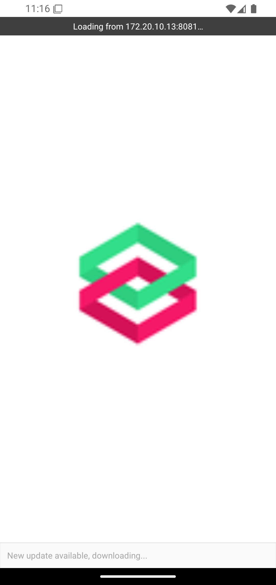
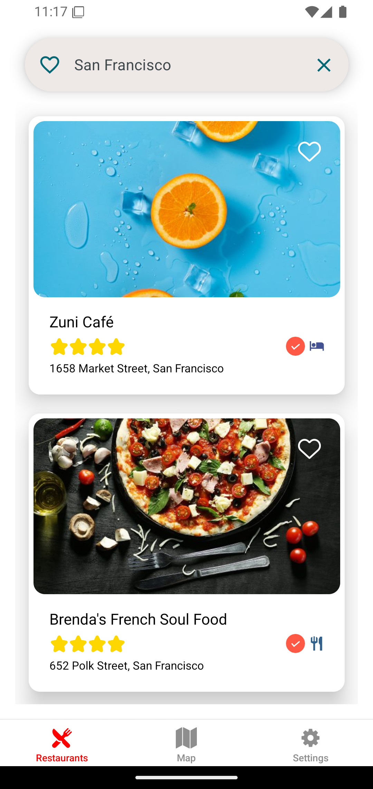
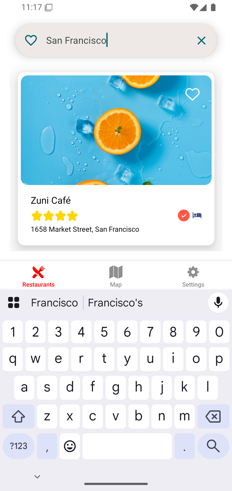
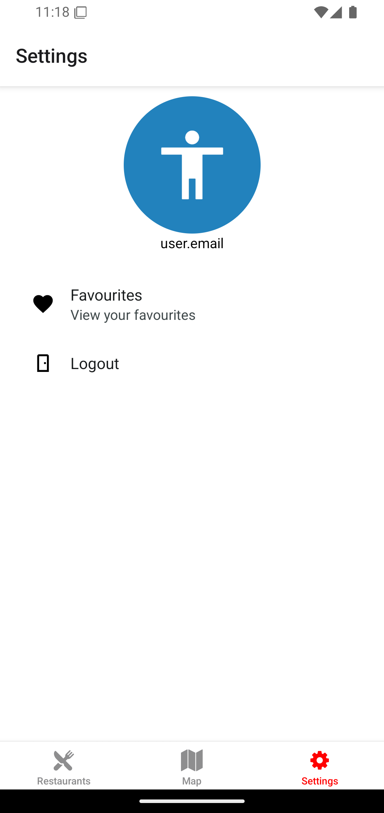
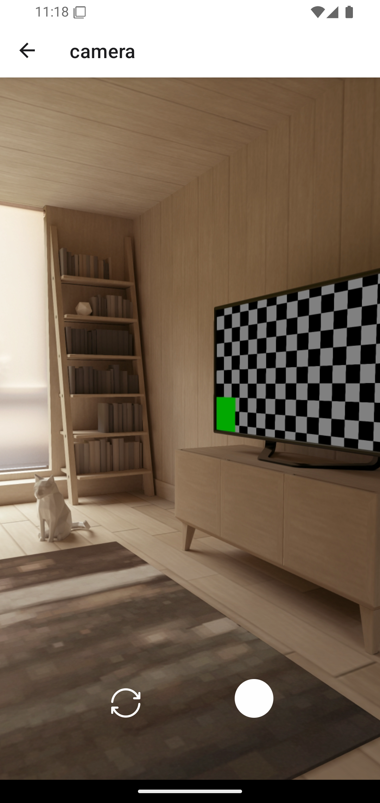
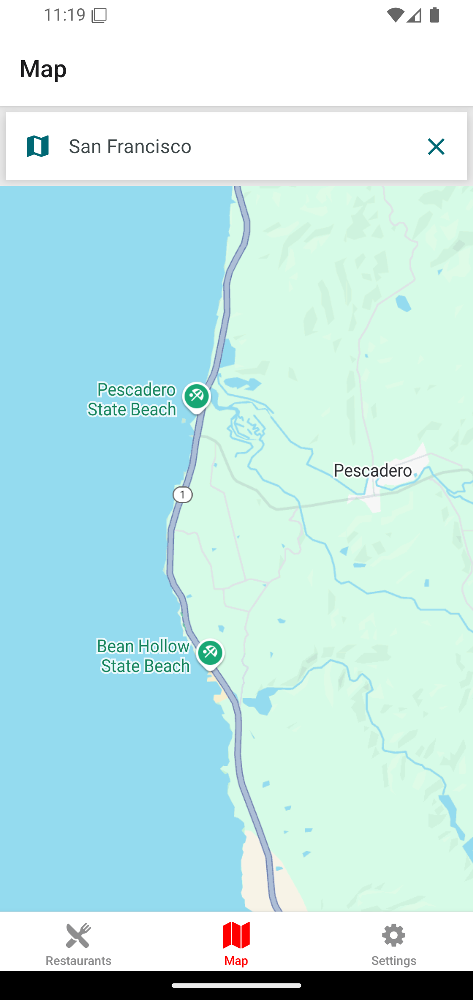
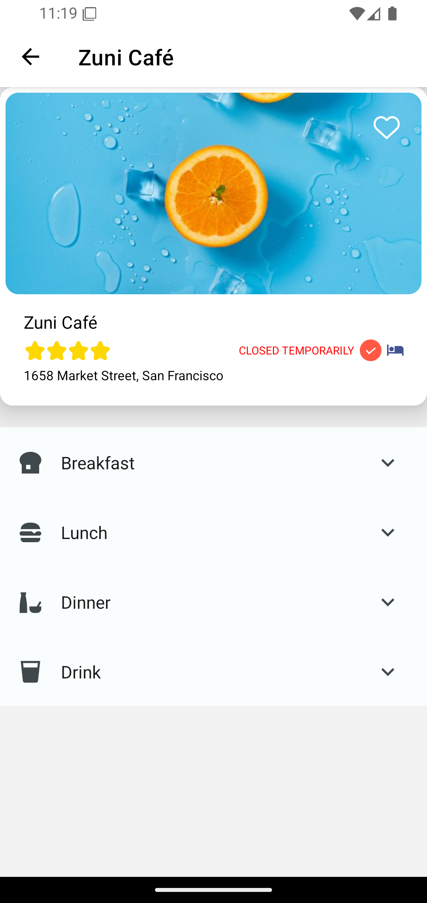
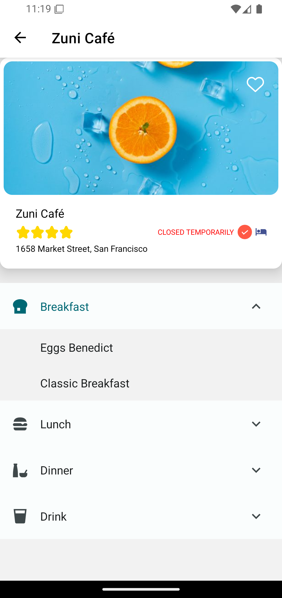

---
# 🍽️ Meals-To-Go — Restaurant App

A beautifully designed restaurant and meal discovery app built with **React Native** and **Expo Router**, packed with rich animations, interactive maps, and real-time Firebase integration. Perfect for foodies looking for delicious meals nearby or planning their next dine-out adventure!

<p align="center">


</p>
---

## 📸 Screenshots

<p align="center">
  
  
  
  
  
  
  
  
</p>

---

## ✨ Features

- 🔍 **Search for Nearby Restaurants**
- 📍 **Interactive Map with Restaurant Pins**
- ⭐ **View Ratings, Photos, and Open/Close Status**
- 💾 **Save Favorites Locally with AsyncStorage**
- 🔥 **Animated Loaders with Lottie**
- 🗺️ **React Native Maps Integration**
- 🧠 **Firebase Integration for Authentication or Dynamic Data**
- 💅 **Themed UI with React Native Paper**
- 🌐 **Seamless Navigation via Expo Router**

---

## 🧰 Tech Stack

### 📦 Core

- **React Native (Expo SDK 52)**
- **Expo Router** for file-based navigation
- **React Navigation** (Bottom Tabs)
- **Firebase** for backend (Auth or DB)

### 🧩 Libraries & Tools

- **React Native Maps** for interactive locations
- **React Native Paper** for theming and UI components
- **AsyncStorage** for saving favorites
- **Lottie React Native** for rich animations
- **Google Fonts (Oswald, Lato, Inter)**

---

## 🗂️ Project Structure

```bash
.
├── app/                      # Screens and navigation (Expo Router)
│   ├── (tabs)/               # Tab-based navigation
│   ├── details/               # resturant details
│   └── _layout.tsx           # Shared layout and navigation config
├── assets/                   # Fonts, icons, images
├── components/               # Reusable components (cards, headers, etc.)
├── services/                 # API and Firebase utilities
├── context/                  # Context for managing global states (e.g., favorites)
├── theme/                    # Custom theme for Paper
├── utils/                    # Utility functions
├── types/                    # Type definitions
├── scripts/                  # Project scripts (e.g., reset-project.js)
└── constants/                # App-wide constants
```

---

## ⚙️ Getting Started

### 1. Clone the Repository

```bash
git clone https://github.com/your-username/meals-to-go.git
cd meals-to-go
```

### 2. Install Dependencies

```bash
npm install
# or
yarn
```

### 3. Add Firebase Config

Create a `.env` file in the root and add:

```env
FIREBASE_API_KEY=your_api_key
FIREBASE_AUTH_DOMAIN=your_project.firebaseapp.com
FIREBASE_PROJECT_ID=your_project_id
FIREBASE_STORAGE_BUCKET=your_project.appspot.com
FIREBASE_MESSAGING_SENDER_ID=sender_id
FIREBASE_APP_ID=app_id
```

### 4. Run the App

```bash
npm run start
```

---

## 🧪 Testing

```bash
npm run test
```

Powered by **Jest** and **jest-expo**.

---

## 🤝 Contributing

Feel free to fork and contribute!

1. Fork it
2. Create a branch (`git checkout -b feature/your-feature`)
3. Commit your changes (`git commit -m 'feat: add your feature'`)
4. Push and open a pull request

---

## 📄 License

This project is licensed under the **MIT License**.

---

## 👨🏽‍🍳 Author

**Chinedu Aguwa**  
📧 [neduaguwa443@gmail.com](mailto:neduaguwa443@gmail.com)  
📞 +234 810 547 1046  
[LinkedIn](https://www.linkedin.com/in/chinedu-aguwa-b1747a2b0) • [GitHub](https://github.com/chi2785443)

---
